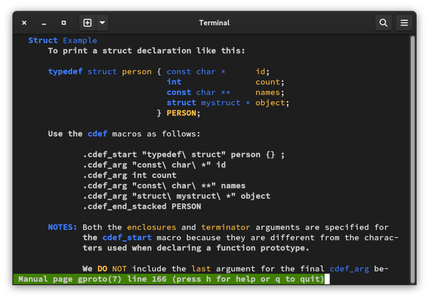

# Groff Macros

Now that I know where to install groff macro files to make them
available to all projects, I am starting a collection of useful
groff macro files that I can reuse in my projects.

The first set of macros, `gproto.tmac`, helps a man page developer
make nice-looking command and function prototypes for the
**SYNOPSIS** section.  The macros make it easier to read the groff
code in an editor and aligns multiline argument lists according to
the type of prototype.

I hope to add more macro files to this project as I revisit and
refine work from previous projects.

## Installation

Simply clone or download the project and run `make` to install
or uninstall the macros.  Installation includes macro files that
go to `/usr/share/groff/site-tmac` and groff files for man pages
that are installed in `/usr/local/share/man/man.7`:

~~~sh
sudo make install
~~~

If you just want to try it out, uninstall will remove everything

~~~sh
sudo make uninstall
~~~

## MAN pages

The documentation, with examples, is in the man page(s).  If you
have cloned the project without installing, access the man page from
the project directory with:

~~~sh
man -l gproto.7
~~~

If you have installed the library, **gproto**(7) will be available
everywhere.

## gproto.tmac

This set of five macros enables an easy implementation of
pleasantly-formatted prototypes for use in the **SYNOPSIS** section
of a man page.  Look at the man page for usage instructions:
`gproto(7)`.

